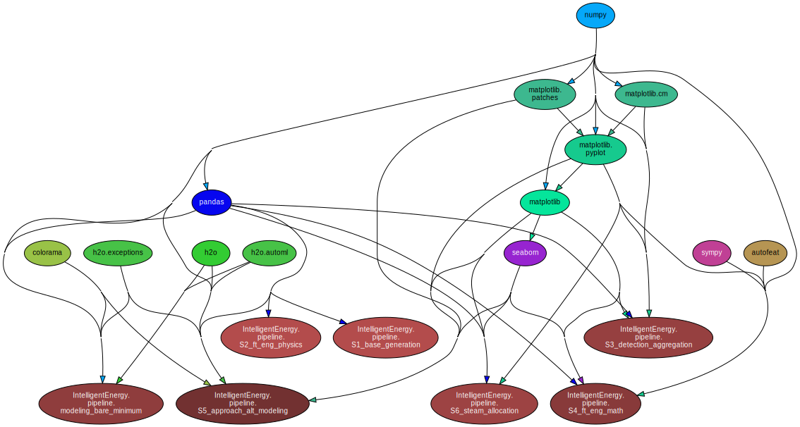

# IntelligentEnergy
Innovative algorithms which use statistical, AI/ML, and forecasting methodologies to analyze oil-and-gas data.
*Note: Client data is not available on Github, and references to such data has beeen de-identified for security purposes*

## Table of Contents:
1. Dependencies
2. Notable File Structure
3. Design Decisions
4. Pipeline
5. Benchmarking and Backtesting
6. Final Implementation
7. Other

## Part 1: Dependencies

<b>Dependency Chart for entire repository</b>

## Part 2: Notable File Structure
File structure content here

## Part 3: Design Decisions
Important design decisions and their motivations

## Part 4: Pipeline
### Overview
There are seven sequential components in the main pipeline of this repository.
1. Source Table Aggregation
2. Physics Feature Engineering
3. Anomaly Detection and Aggregation
4. Mathematical Feature Engineering
5. Model Creation and Performance
6. Optimization and Producer-Level Steam Allocation
7. Injector-Level Steam Allocation

### Stage 1: Source Table Aggregation
This section will outline the core steps conducted to pre-process the data. The purpose of this step is to ensure clean, restructured, and engineered data which makes sense for predictive modeling algorithms and framework in **Stage 2: Data Modeling**.

### Stage 2: Physics Feature Engineering
This section will overview the core steps conducted *with* the pre-processed data to develop accurate and robust predictive models. The purpose of this step is to generate even *further* pre-processed data (from a modeling standpoint) and complementary models.

## Part 5: Benchmarking and Backtesting

## Part 6: Final Implementation

## Part 7: Other
