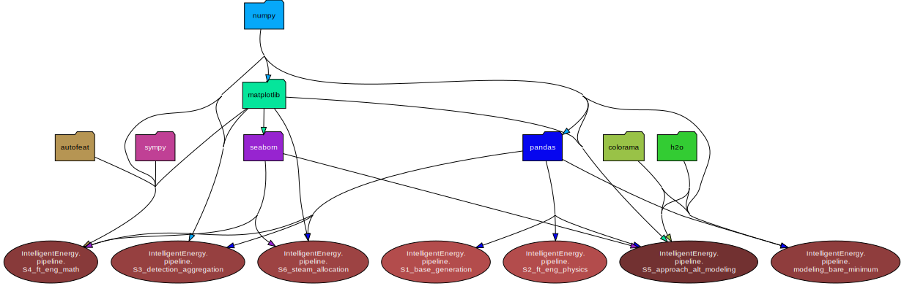
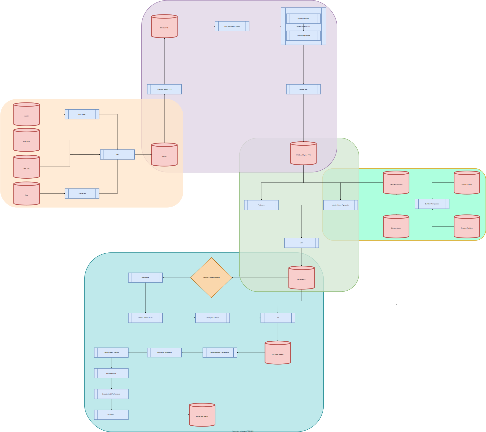

# IntelligentEnergy
Innovative algorithms which use statistical, AI/ML, and forecasting methodologies to analyze oil-and-gas data.
*Note– Client data is not available on Github, and references to such data has beeen de-identified for security purposes*

## Table of Contents:
1. [Dependencies](#part-1---dependencies)
2. [Notable File Structure](#part-2---notable-file-structure)
3. [Design Decisions](#part-3---design-decisions)
4. [Pipeline](#part-4---pipeline)
5. [Benchmarking and Backtesting](#part-5---benchmarking-and-backtesting)
6. [Final Implementation](#part-6---final-implementation)
7. [Other](#part-7---other)

## Part 1 - Dependencies

<b>Dependency Chart for entire repository</b>

## Part 2 - Notable File Structure
File structure content here

## Part 3 - Design Decisions
Important design decisions and their motivations

## Part 4 - Pipeline
### Overview
There are seven sequential components in the main pipeline of this repository.
1. [Source Table Aggregation](#stage-1---source-table-aggregation)
2. [Physics Feature Engineering](#stage-2---physics-feature-engineering)
3. [Anomaly Detection and Aggregation](#stage-3---anomaly-detection-and-aggregation)
4. [Mathematical Feature Engineering](#stage-4---mathematical-feature-engineering)
5. [Model Creation and Performance](#stage-5---model-creation-and-performance)
6. [Optimization and Producer Level Steam Allocation](#stage-6---optimization-and-producer-level-steam-allocation)
7. [Injector Level Steam Allocation](#stage-7---injector-level-steam-allocation)

<b>Process Flow of Pipeline</b>

### Stage 1 - Source Table Aggregation
Joining the production, production testing, injection, and fiber data.

### Stage 2 - Physics Feature Engineering
Generating new features based on domain-specific [modified] SAGD knowledge.

### Stage 3 - Anomaly Detection and Aggregation
Using custom anomaly detection package to determine weights.

### Stage 4 - Mathematical Feature Engineering
Generating new features - solely based on combinatorial explosions that are helpful towards model performance.

### Stage 5 - Model Creation and Performance
Running the h2o experiment, assesssing model performance, and picking the best ones.

### Stage 6 - Optimization and Producer Level Steam Allocation
Determinining optimization base table and using domain-specific contraints to tune high-level steam allocation.

### Stage 7 - Injector Level Steam Allocation
The highest resolution of steam allocation.

## Part 5 - Benchmarking and Backtesting
Using the top performing models and running incremental backtests to compare recommended and actual steam allocations.

## Part 6 - Final Implementation
Based on model performance and general design of project, what's the best way to implement it.

## Part 7 - Other
Miscellaneous.
